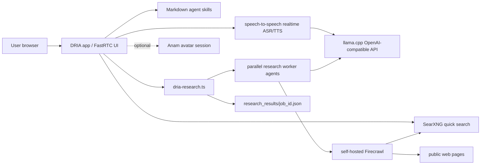

# DRIA V2
https://github.com/user-attachments/assets/7de70c8a-b837-4f2e-9982-18e2bda8dba6

DRIA is a local-first Deep Research and Intelligence Agent with realtime voice,
optional Anam avatar video, local web search, and background multi-agent deep
research.

The project is designed so the normal research loop can run without hosted LLM,
search, or scraping APIs:

- LLM reasoning: local OpenAI-compatible llama.cpp server
- Realtime ASR/TTS: local Hugging Face `speech-to-speech` server
- Quick web search: local SearXNG
- Deep research search/scrape: self-hosted Firecrawl backed by SearXNG
- Voice/UI bridge: FastRTC plus FastAPI
- Optional avatar: Anam passthrough, enabled only when you start an avatar session


## Architecture



## Main Features

- Realtime microphone conversation through a FastRTC browser UI.
- DRIA persona in `SOUL.md`, reloaded without rebuilding the image.
- Optional private long-term memory in `MEMORY.md`.
- Markdown skills in `agent_skills/`, exposed as realtime tools where supported.
- Local SearXNG search skill for current information.
- Multi-agent deep research: the live DRIA conversation starts a background job,
  while spawned research agents search, scrape, and synthesize independently.
- Dockerized app, search stack, Firecrawl stack, llama.cpp, and speech-to-speech
  stack.
- Optional Anam avatar using Cara 3 and local TTS passthrough, with a UI toggle
  to avoid using avatar credits when it is not needed.
- Optional webcam/vision endpoint for injecting recent camera context.

## Requirements

For the full Docker stack:

- Docker Desktop with Docker Compose v2.
- NVIDIA GPU support in Docker if you run the GPU llama.cpp and speech services.
- Internet access on first run so Docker can pull images and download the local
  model, ASR, and TTS assets into Docker volumes.
- Enough RAM/VRAM and disk space for the selected model, speech models,
  Firecrawl, and browser extraction services.

Optional:

- An Anam API key if you want the avatar.
- A custom reference voice file named `main_voice.wav`. The file is ignored by
  git, but Docker will use it automatically when it exists.

## Quick Start: Full Docker Stack

1. Clone the repository.

```bat
git clone <your-repo-url>
cd "DRIA V2"
```

2. Create a private `.env` file from the template.

```bat
copy .env.example .env
```

3. Edit `.env` for your machine.

For avatar support, paste your Anam key after the equals sign:

```text
ANAM_API_KEY=
ANAM_ENABLED=true
ANAM_AVATAR_ID=30fa96d0-26c4-4e55-94a0-517025942e18
ANAM_AVATAR_MODEL=cara-3
ANAM_PERSONA_NAME=DRIA
```

Leave `ANAM_API_KEY` empty, or set `ANAM_ENABLED=false`, if you do not want
avatar support. Advanced model paths, ports, and service settings can also be
overridden in `.env` when your machine needs different values.

4. Start everything.

```bat
docker compose -f docker-compose.yml -f docker-compose.gpu.yml up --build
```

Or use:

```bat
run_docker_full.cmd
```

5. Open the UI.

```text
http://127.0.0.1:7860/ui
```

The first run can take a while because Docker pulls Firecrawl, SearXNG,
RabbitMQ, Redis, Postgres, llama.cpp, builds the speech image, and downloads:

- `gemma-4-E4B-it-Q8_0.gguf` for the local LLM.
- `mmproj-BF16.gguf` for llama.cpp vision/multimodal support.
- The speech-to-speech ASR/TTS models.
- A public Qwen3-TTS reference clip, only if `main_voice.wav` is not present.

If `main_voice.wav` exists in the project folder, speech-to-speech uses that
local ignored voice file instead of the public fallback. If you replace
`main_voice.wav` with a recording that says different words, set
`S2S_LOCAL_REF_TEXT` in `.env` to the exact text spoken in the clip.

## Services And Ports

| Service | Purpose | Host URL |
| --- | --- | --- |
| `app` | DRIA UI, FastRTC bridge, agent skills, avatar bridge | `http://127.0.0.1:7860/ui` |
| `llama-cpp` | OpenAI-compatible local model API | `http://127.0.0.1:8080/v1` |
| `speech-to-speech` | Realtime ASR/TTS websocket | `ws://127.0.0.1:8765/v1/realtime` |
| `searxng` | Local metasearch JSON API | `http://127.0.0.1:8081` |
| `firecrawl` | Self-hosted search/scrape API | `http://127.0.0.1:3002` |
| `firecrawl-playwright` | Browser extraction helper | internal only |
| `firecrawl-redis` | Firecrawl queue/cache | internal only |
| `firecrawl-rabbitmq` | Firecrawl jobs | internal only |
| `firecrawl-postgres` | Firecrawl local database | internal only |

Inside Docker, the app uses internal service names:

```text
REALTIME_WS_URL=ws://speech-to-speech:8765/v1/realtime
LLAMACPP_BASE_URL=http://llama-cpp:8080/v1
SEARXNG_BASE_URL=http://searxng:8080
FIRECRAWL_API_URL=http://firecrawl:3002
```

Firecrawl uses:

```text
SEARXNG_ENDPOINT=http://searxng:8080
```

That is the setting that keeps deep-research web search on local SearXNG rather
than a hosted search backend.

## App-Only Docker Mode

If you already run llama.cpp and speech-to-speech on the host, you can run just
the base app/search stack:

```bat
docker compose up --build
```

The app can reach host services through `host.docker.internal`:

```text
REALTIME_WS_URL=ws://host.docker.internal:8765/v1/realtime
LLAMACPP_BASE_URL=http://host.docker.internal:8080/v1
```

## Configuration

Configuration lives in `.env`. Do not commit `.env`.

Common settings:

| Variable | Purpose | Default |
| --- | --- | --- |
| `REALTIME_WS_URL` | OpenAI Realtime-compatible websocket for voice | Docker service or host URL |
| `LLAMACPP_BASE_URL` | Local OpenAI-compatible model endpoint | `http://llama-cpp:8080/v1` in full Docker |
| `LOCAL_MODEL` | Model name passed to local OpenAI-compatible APIs | `gemma-4-E4B-it` in Docker |
| `SEARXNG_BASE_URL` | Direct quick-search backend | `http://searxng:8080` in Docker |
| `FIRECRAWL_API_URL` | Deep research search/scrape backend | `http://firecrawl:3002` in Docker |
| `DRIA_RESEARCH_MAX_WORKERS` | Parallel deep-research worker agents | `2` |
| `DRIA_AGENT_MAX_OUTPUT_TOKENS` | Caps local agent output per worker | `1024` |
| `ANAM_API_KEY` | Server-side key for optional Anam avatar | empty |
| `ANAM_AVATAR_MODEL` | Anam avatar model | `cara-3` |
| `ANAM_PERSONA_NAME` | Avatar/persona label | `DRIA` |
| `AGENT_MEMORY_ENABLED` | Enable private memory writes to `MEMORY.md` | `false` |
| `VISION_ENABLED` | Enable camera snapshot analysis | `false` |

See [.env.example](./.env.example) for the minimal local template. Advanced
optional values can also be overridden in `.env`; the Docker compose files and
`app.py` show the defaults used by the app.

## Deep Research

The `dria-deep-research` skill starts a background job and immediately returns a
`job_id`, so you can keep talking to DRIA while research runs.

Flow:

```text
voice request
  -> app.py starts background research job
  -> dria-stack/dria-research.ts
  -> one worker agent per research angle
  -> Firecrawl search and scrape
  -> SearXNG as Firecrawl search backend
  -> local llama.cpp synthesis
  -> research_results/<job_id>.json
```

Each result includes `agent_runtime`, which records worker count, worker status,
timings, local model endpoint, and Firecrawl endpoint. That makes it easy to
confirm that the job actually used the multi-agent path.

Useful endpoints:

```bat
curl http://127.0.0.1:7860/agent/research_jobs
curl http://127.0.0.1:7860/agent/research_jobs/<job_id>
```

Start a research job:

```bat
curl -X POST http://127.0.0.1:7860/agent/skills/dria-deep-research/run ^
  -H "Content-Type: application/json" ^
  -d "{\"query\":\"current indirect prompt injection defenses for MCP servers\",\"breadth\":3,\"max_sources\":6}"
```

## Quick Search

The `internet_search` skill talks directly to SearXNG:

```bat
curl -X POST http://127.0.0.1:7860/agent/skills/internet_search/run ^
  -H "Content-Type: application/json" ^
  -d "{\"query\":\"OpenAI latest news\",\"max_results\":3}"
```

SearXNG must allow JSON output. This is configured in
[dria-stack/searxng/settings.yml](./dria-stack/searxng/settings.yml):

```yaml
search:
  formats:
    - html
    - json
```

## Skills

Skills are Markdown folders containing `SKILL.md`:

```text
agent_skills/calculate/SKILL.md
agent_skills/conversation-style/SKILL.md
agent_skills/dria-deep-research/SKILL.md
agent_skills/get-time/SKILL.md
agent_skills/internet-search/SKILL.md
agent_skills/vision-context/SKILL.md
```

The bridge reads frontmatter, injects the skill catalogue into DRIA's realtime
instructions, and registers executable skills as tools where the realtime
backend supports tool calls.

List skills:

```bat
curl http://127.0.0.1:7860/agent/skills
```

## Persona And Memory

| File | Purpose | Git status |
| --- | --- | --- |
| `SOUL.md` | DRIA persona, behavior, and speaking style | tracked |
| `MEMORY.md.example` | safe template for memory | tracked |
| `MEMORY.md` | private long-term user memory | ignored |

`SOUL.md` is re-read when the bridge sends a realtime session update. Memory is
controlled by `AGENT_MEMORY_ENABLED`.

## Avatar

The avatar path is optional and credit-sensitive.

- The UI has an avatar toggle.
- No avatar session is started until you press Start Avatar.
- The bridge requests a short-lived session token from Anam.
- `ANAM_API_KEY` stays server-side and is never sent to the browser.
- Local FastRTC assistant playback is suppressed while the avatar is active, so
  Anam video and audio stay on the same playback clock.

Useful endpoints:

```bat
curl http://127.0.0.1:7860/anam/config
curl -X POST http://127.0.0.1:7860/anam/session-token
curl -X POST http://127.0.0.1:7860/anam/state -H "Content-Type: application/json" -d "{\"active\":false}"
```

## Vision

When `VISION_ENABLED=true`, clients can post camera snapshots to
`/vision/analyze`. The bridge stores the latest visual context and injects it
into DRIA's realtime session instructions.

Useful endpoints:

```bat
curl http://127.0.0.1:7860/vision/latest
curl http://127.0.0.1:7860/agent/skills/vision_context
```

## Local Development

Install Node dependencies and bootstrap the vendored Firecrawl `agent-core`:

```bat
npm.cmd install
npm.cmd run bootstrap:agent-core
```

Run the Python app locally:

```bat
run_fastrtc.cmd
```

Run host-side llama.cpp and speech services:

```bat
run_llama_cpp.cmd
run_backend_cuda.cmd
```

Run the TypeScript research runner directly:

```bat
npm.cmd run research -- "your research question"
```

## Secret Safety Before Pushing

This repository is configured so private runtime files are ignored:

- `.env`
- `.env.*` except `.env.example`
- `MEMORY.md`
- `research_results/*` except `.gitkeep`
- `data/`
- `secrets/`
- key/certificate files such as `*.key`, `*.pem`, `*.p12`, `*.pfx`
- local model formats such as `*.gguf`, `*.safetensors`, `*.onnx`, `*.pt`

Before pushing to GitHub, run:

```bat
git status --short --ignored .env
git ls-files .env
```

Expected result:

- `.env` appears as ignored.
- `git ls-files .env` prints nothing.

Also check for staged secrets:

```bat
git diff --cached --name-only
```

Run the repository's redacted secret check:

```powershell
powershell -ExecutionPolicy Bypass -File scripts/check-secrets.ps1
```

If you accidentally staged a secret file, unstage it without deleting your local
copy:

```bat
git restore --staged .env
```

Use `.env.example` for safe placeholder documentation. Real API keys belong only
in `.env` or your deployment secret manager.

## Troubleshooting

Search tool returns no results:

- Check `http://127.0.0.1:8081/search?q=test&format=json`.
- Check `SEARXNG_BASE_URL` inside the app container.
- Confirm `search.formats` includes `json` in SearXNG settings.

Deep research cannot search:

- Check Firecrawl is running on `http://127.0.0.1:3002`.
- Confirm the app sees `FIRECRAWL_API_URL=http://firecrawl:3002`.
- Confirm Firecrawl sees `SEARXNG_ENDPOINT=http://searxng:8080`.

Avatar says concurrency limit reached:

- Stop the avatar in the UI.
- Wait for any leaked Anam session to expire or end it in the Anam dashboard.
- The bridge guards duplicate session starts, but Anam plan limits still apply
  to sessions already active on Anam's side.

Local model context errors:

- Reduce `DRIA_RESEARCH_MAX_WORKERS`.
- Reduce `DRIA_AGENT_MAX_OUTPUT_TOKENS`.
- Increase `LLAMA_CPP_CONTEXT`.
- Reduce `LLAMA_CPP_PARALLEL` so each slot has more context.

## License

Add your chosen license before publishing publicly.
